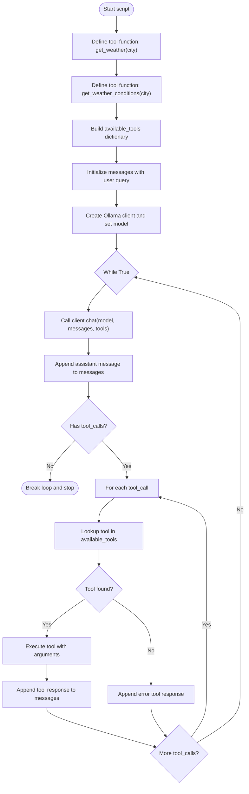

ollama-python/examples/gpt-oss-tools.py

```mermaid
flowchart TD
    A([Start script]) --> B["Define tool function: get_weather(city)"]
    B --> C["Define tool function: get_weather_conditions(city)"]
    C --> D["Build available_tools dictionary"]
    D --> E["Initialize messages with user query"]
    E --> F["Create Ollama client and set model"]
    F --> G{While True}

    G --> H["Call client.chat(model, messages, tools)"]
    H --> O["Append assistant message to messages"]

    O --> P{Has tool_calls?}
    P -- No --> Z([Break loop and stop])

    P -- Yes --> Q["For each tool_call"]
    Q --> R["Lookup tool in available_tools"]
    R --> S{Tool found?}

    S -- Yes --> T["Execute tool with arguments"]
    T --> V["Append tool response to messages"]
    V --> W{More tool_calls?}
    W -- Yes --> Q
    W -- No --> G

    S -- No --> Y["Append error tool response"]
    Y --> W
```